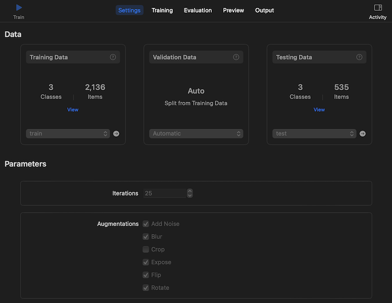
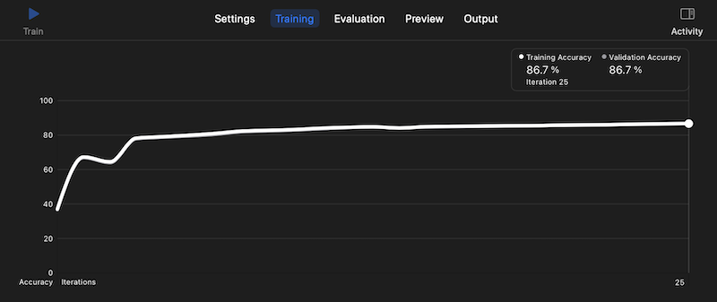
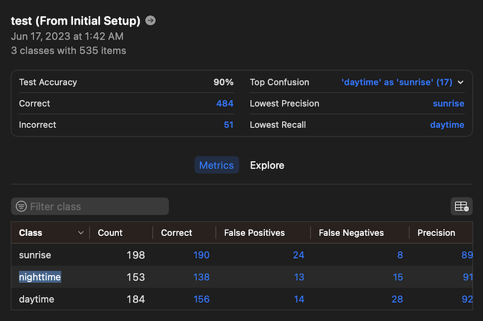
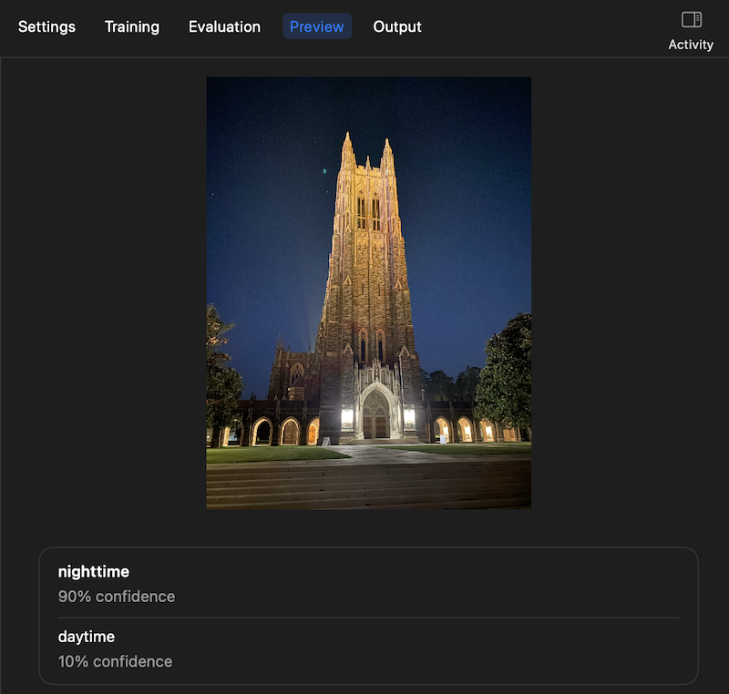
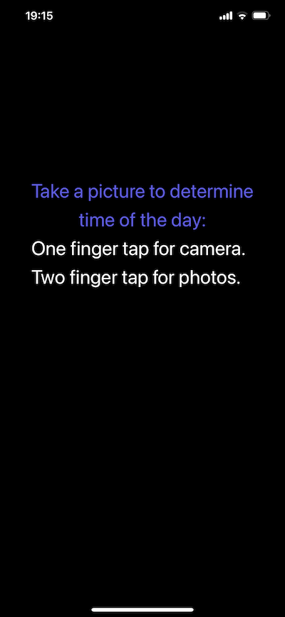
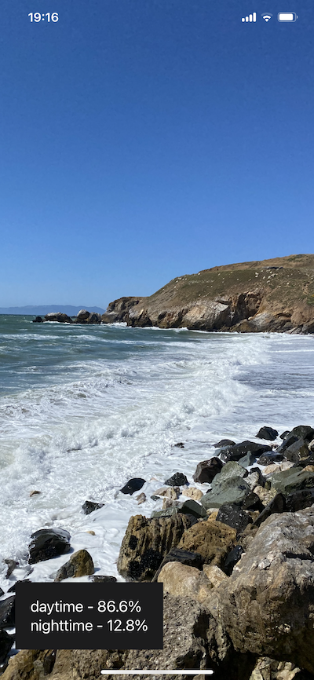
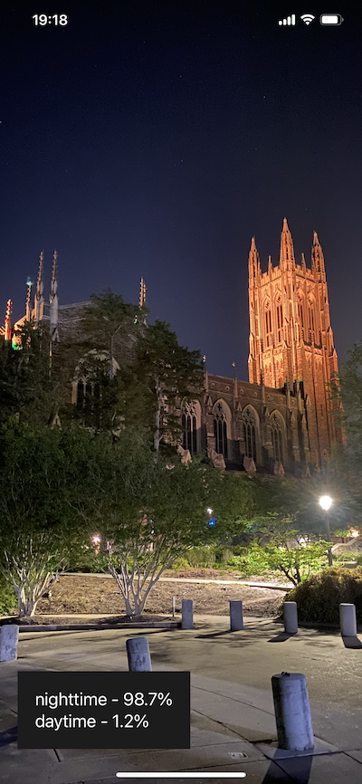

# Time of Day Classifier with Create ML
This project uses the Apple Create ML framework to automatically train an image classifier that determines whether the time of day represented in a photo is day time, night time, or sunrise. 

## Data
The data used in this project is from a publicly available dataset hosted on Kaggle: [Time Of Day Dataset](https://www.kaggle.com/datasets/aymenkhouja/timeofdaydataset). It consists of 2671 JPEG files, each having a resolution of 224 pixels by 224 pixels. The images are categorized into 3 distinct groups: `daytime`, `nighttime`, and `sunrise`.

## Training
Create ML is used for training and evaluating the machine learning model. Image classification was selected as the task of the project, and the Time Of Day dataset was specified as the data source. The training and test data ratio was set at 80:20. Validation data was automatically split from training data by Create ML. The three different class labels were automatically identified by Create ML according to the name of the directories where the three types of images reside in. In terms of training parameters, the number of iterations was set at 25 and a selection of data augmentation techniques were chosen: Noise, Blur, Expose, Flip, and Rotate. These augmentation techniques help to artifically increase the training data and exposes the model to variations that may be encountered in unseen data.

The model achieved a training accuracy of **86.7%** by the end of 25 iterations.

Screenshot of Create ML settings:


Screenshot of Create ML training progress:


## Evaluation
Create ML performs evaluation on the test data and reports some common metrics, including accuracy, precision, recall, and F1 scores. A confusion matrix is also displayed to show what classes were the most commonly misclassified and what classes the model did well in.

The model achieved an overall test accuracy of **90%**, as it misclassified about 10% of the test images. The top confusion for the model was labeling 'daytime' as 'sunrise', which may sometimes be confusing for human beings as well. 

Screenshot of Create ML evaluation metrics:


The confusion matrix is reproduced below:

| Class | Count | Correct | False Positives | False Negatives | Precision | Recall | F1 Score |
| --- | --- | --- | --- | --- | --- | --- | --- |
| sunrise | 198 | 190 | 24 | 8 | 89% | 96% | 0.92 |
| nighttime | 153 | 138 | 13 | 15 | 91% | 90% | 0.91 |
| daytime | 184 | 156 | 14 | 28 | 92% | 85% | 0.88 |

Create ML makes it easy to perform quick evaluation of the model with your own images. By navigating to the Preview tab, you are able to upload your own photo for the model to perform prediction on. The corresponding class labels and confidence scores are also displayed.

Screenshot of Create ML Preview:


## Deployment
An iOS mobile application was created to demonstrate the use of this machine learning model developed from Create ML. The mobile app accepts as input a photo and displays predictions about the time of the day along with the corresponding confidence scores. Users can take a picture using their camera or select a photo from their photo gallery.

Screenshots of mobile app:







## Setup
1. Clone this git repository.
2. Download the dataset from Kaggle and unzip the contents to a directory called `temp` in the root of this repo.
3. Run the following commands to split the dataset into train and test sets:
```bash
mkdir -p data/train/daytime data/test/daytime data/train/nighttime data/test/nighttime data/train/sunrise data/test/sunrise 
python scripts/split_data.py --source ./temp/daytime --dest-train ./data/train/daytime --dest-test ./data/test/daytime --pct-train 0.8
python scripts/split_data.py --source ./temp/nighttime --dest-train ./data/train/nighttime --dest-test ./data/test/nighttime --pct-train 0.8
python scripts/split_data.py --source ./temp/sunrise --dest-train ./data/train/sunrise --dest-test ./data/test/sunrise --pct-train 0.8
```
4. Launch Create ML program and create a new image classification project.
5. Specify the train and test datasets by indicating the paths to the directories mentioned above.
6. Select or adjust parameters as desired. Then click on **Train** to begin training.
7. Inspect evaluation results and play around with the **Preview** functionality.
8. Launch the XCode project located at `ios_app/Time-of-Day.xcodeproj` and click **Build**.
9. Verify that the iOS app works in the simulator.

## Repository Structure
```
|____ios_app
| |____App
| | |____Assets.xcassets
| | | |____AppIcon.appiconset
| | | | |____Icon-App-76x76@2x.png
| | | | |____Icon-App-83.5x83.5@2x.png
| | | | |____Icon-App-20x20@3x.png
| | | | |____ItunesArtwork@2x.png
| | | | |____Contents.json
| | | | |____Icon-App-20x20@2x.png
| | | | |____Icon-App-29x29@3x.png
| | | | |____Icon-App-40x40@2x.png
| | | | |____Icon-App-60x60@3x.png
| | | | |____Icon-App-60x60@2x.png
| | | | |____Icon-App-40x40@3x.png
| | | | |____Icon-App-29x29@2x.png
| | | |____Contents.json
| | |____Base.lproj
| | | |____LaunchScreen.storyboard
| | |____AppDelegate.swift
| | |____Info.plist
| |____Models
| | |____TimeOfDayClassifier.mlmodel
| |____Time-of-Day.xcodeproj
| | |____project.pbxproj
| | |____.xcodesamplecode.plist
| | |____xcshareddata
| | | |____xcschemes
| | | | |____Time of Day.xcscheme
| |____Extensions
| | |____VNClassificationObservation+confidenceString.swift
| | |____CGImagePropertyOrientation+UIImageOrientation.swift
| |____Main View
| | |____MainViewController.swift
| | |____Base.lproj
| | | |____Main.storyboard
| | |____MainViewController+CameraPicker.swift
| | |____MainViewController+PhotoPicker.swift
| |____.gitignore
| |____Image Predictor
| | |____ImagePredictor.swift
|____ml_model
| |____TimeOfDayClassifier.mlmodel
| |____TimeOfDayClassifier.mlproj
| | |____Snapshots
| | |____Project.json
| | |____Data Sources
| | | |____test.json
| | | |____train.json
| | |____Model Containers
| | | |____TimeOfDayClassifier 1.json
| | |____Models
| | | |____TimeOfDayClassifier 1.mlmodel
|____README.md
|____.gitignore
|____scripts
| |____split_data.py
|____assets
  |____create_ml_evaluation.png
  |____create_ml_preview.png
  |____ios_app_nighttime.png
  |____create_ml_training.png
  |____ios_app_daytime.png
  |____create_ml_settings.png
  |____ios_app_prompt.png
```